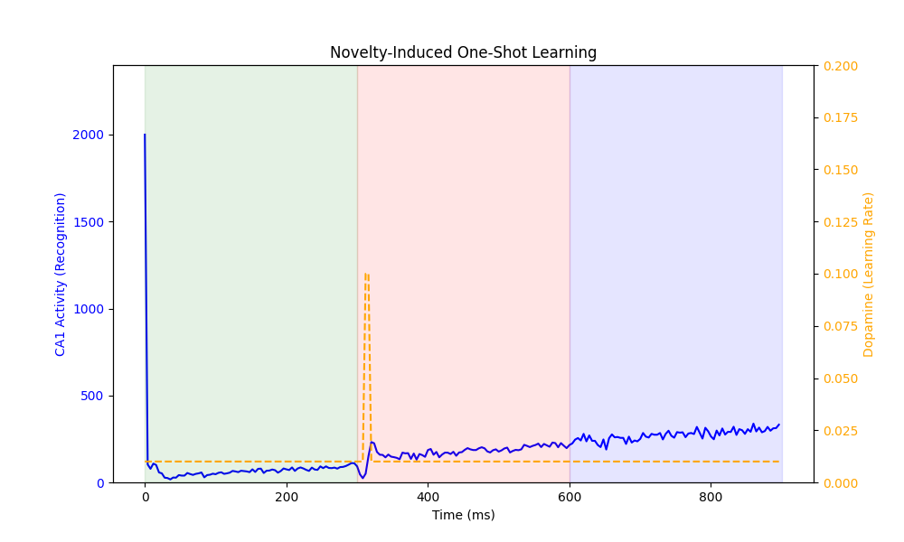
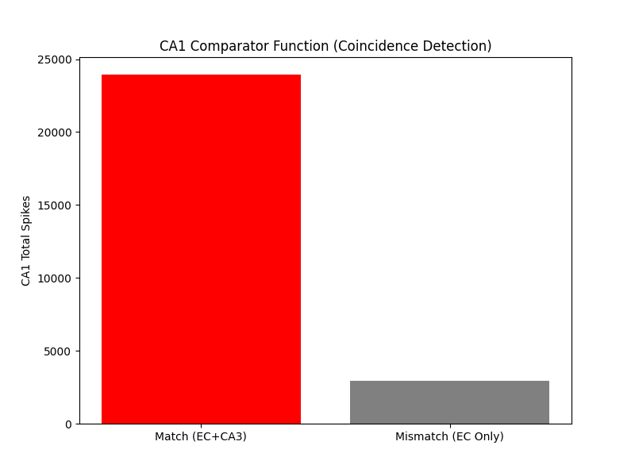
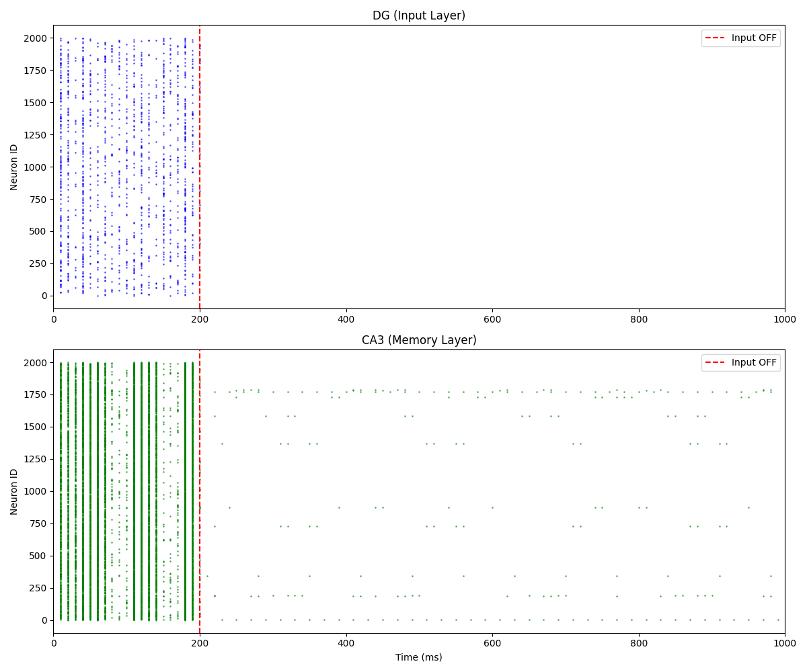
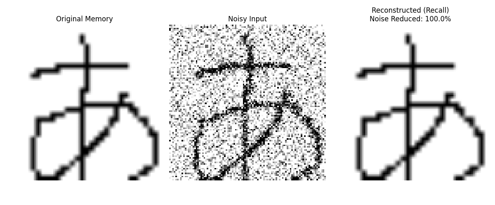
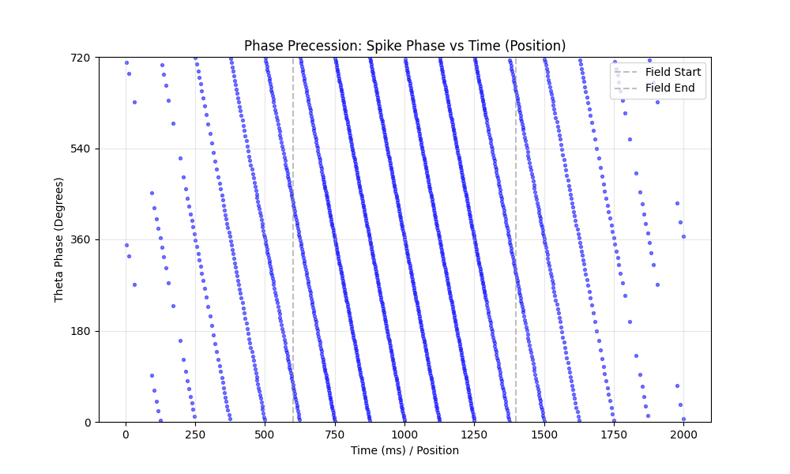

# 🧠 Hippocampal-SNN-Crypt

**GPU-Accelerated Spiking Neural Network (SNN) Simulation of the Hippocampal Trisynaptic Circuit.**

This project simulates the information processing mechanisms of the mammalian hippocampus (Entorhinal Cortex -> DG -> CA3 -> CA1) using **Python** and **Numba (CUDA)**.
It runs biological neuronal models (Izhikevich) in real-time on consumer GPUs (e.g., RTX 5080), replicating cognitive functions such as **Memory Formation**, **Pattern Separation**, and **Time Compression (Phase Precession)**.

*(Originally started as a bio-inspired encryption PoC, this project has evolved into a full-scale Computational Neuroscience research platform.)*

---

## 🚀 Key Features

*   **GPU Acceleration**: Utilizing `Numba.cuda` to simulate tens of thousands of neurons and millions of synapses in parallel.
*   **Biologically Plausible**:
    *   **Izhikevich Neuron Models**: Reproducing spiking behaviors of Granule Cells and Pyramidal Cells.
    *   **STDP Learning**: Synaptic weights evolve based on spike timing (Hebbian learning).
    *   **Theta Rhythm**: Simulating 8Hz brain waves to modulate information flow.
*   **Full Circuit Integration**: Connecting **DG** (Pattern Separation), **CA3** (Recurrent Memory), and **CA1** (Comparator).

---

## 📦 Requirements

*   Python 3.8+
*   NVIDIA GPU with CUDA support
*   Libraries:
    ```bash
    pip install numpy matplotlib opencv-python numba scikit-learn
    ```

---

## 🧪 Experiments & Usage

This repository is organized by "Versions," each representing a specific stage of hippocampal implementation.

### v2.1: Novelty Detection & One-Shot Learning
**Location:** `v2.1_novelty_detection/`
Simulates the release of **Dopamine** when CA1 detects a mismatch (Novelty), triggering rapid one-shot learning.
```bash
cd v2.1_novelty_detection
python experiment_novelty.py
```
*   **Goal**: Demonstrate that "Surprise" (mismatch) boosts the learning rate, allowing the network to instantly memorize a new pattern.

### v2.0: Comparator (Reality vs Memory)
**Location:** `v2.0_comparator/`
Simulates **CA1** acting as a comparator between sensory input (EC) and memory prediction (CA3).
```bash
cd v2.0_comparator
python experiment_comparator.py
```
*   **Goal**: Confirm that CA1 fires strongly only when "Reality" matches "Memory" (Coincidence Detection).

### v1.2: Full Trisynaptic Circuit
**Location:** `v1.2_ca1_integration/`
Integrates **DG -> CA3 -> CA1**. Demonstrates memory retrieval from partial cues.
```bash
cd v1.2_ca1_integration
python experiment_ca1_integration.py
```

### v1.1: Visual Working Memory (The Mind's Eye)
**Location:** `v1.1_visual_circuit/`
Visualizes the "memory trace" reverbrating in the network after the visual input is removed.
```bash
cd v1.1_visual_circuit
python experiment_visual_circuit.py
```

### v0.4: Phase Precession (Time Compression)
**Location:** `v0.4_phase_precession/`
Reproduces the phenomenon where spike timing shifts relative to Theta phase as a rat moves through a place field.
```bash
cd v0.4_phase_precession
python experiment_phase_precession.py
```

---

## 📊 Results Gallery

### v2.1: Novelty-Induced One-Shot Learning
When a novel pattern (Red Zone) is presented, CA1 activity drops. This mismatch triggers a **Dopamine Surge (Orange Line)**, boosting the learning rate.
As a result, the network instantly learns the pattern, showing high recognition activity in the subsequent phase (Blue Zone).


### v2.0: Comparator Function
CA1 acts as an AND-gate for Reality (EC) and Memory (CA3).


### v1.0: Memory Reverberation (Attractor)
Information persists in CA3 recurrent loops even after input cessation.


### v0.6: Pattern Completion (100% Noise Reduction)
Restoring a clean image from noisy input using STDP memory.


### v0.4: Phase Precession
Temporal compression of sequence information into Theta cycles.


---

## 📅 Project Roadmap & History

- [x] **v0.1**: Theta Phase Modulation Engine (Gating Mechanism)
- [x] **v0.2**: Pattern Separation in Dentate Gyrus (DG)
- [x] **v0.3**: Memory Formation via STDP Learning
- [x] **v0.4**: Phase Precession (Temporal Compression)
- [x] **v0.5**: Visual Memory Encoding (Engram Visualization)
- [x] **v0.6**: Pattern Completion (Noise Reduction 100%)
- [x] **v0.7**: CA3 Recurrent Network (Reverberation)
- [x] **v0.8**: Associative Memory (Recall from partial cues)
- [x] **v0.9**: DG-CA3 Signal Transmission Test
- [x] **v1.0**: Full Memory Circuit (DG -> CA3 Attractor)
- [x] **v1.1**: Visual Working Memory (The Mind's Eye)
- [x] **v1.2**: CA1 Integration (Memory Retrieval)
- [x] **v2.0**: CA1 Comparator (Reality vs Memory Check)
- [x] **v2.1**: **Novelty Detection (Mismatch triggers new learning)**
- [ ] **v3.0**: Closed-loop System (CA1 -> EC Feedback)

## 👤 Author

**Hafufu**
*   **note**: [https://note.com/cell_activation](https://note.com/cell_activation) (Research Log & Thoughts)
*   **Zenn**: [https://zenn.dev/cell_activation](https://zenn.dev/cell_activation) (Technical Articles & Implementation Details)
