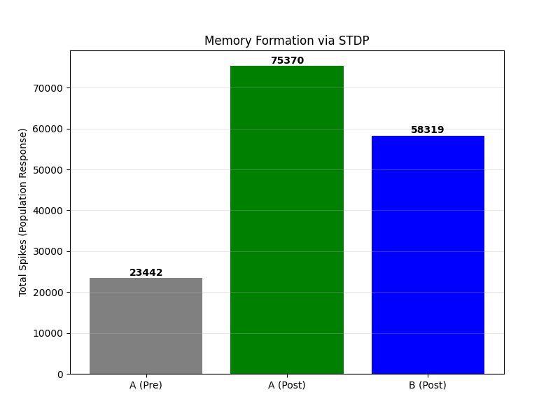
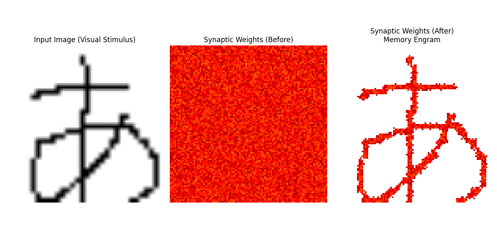
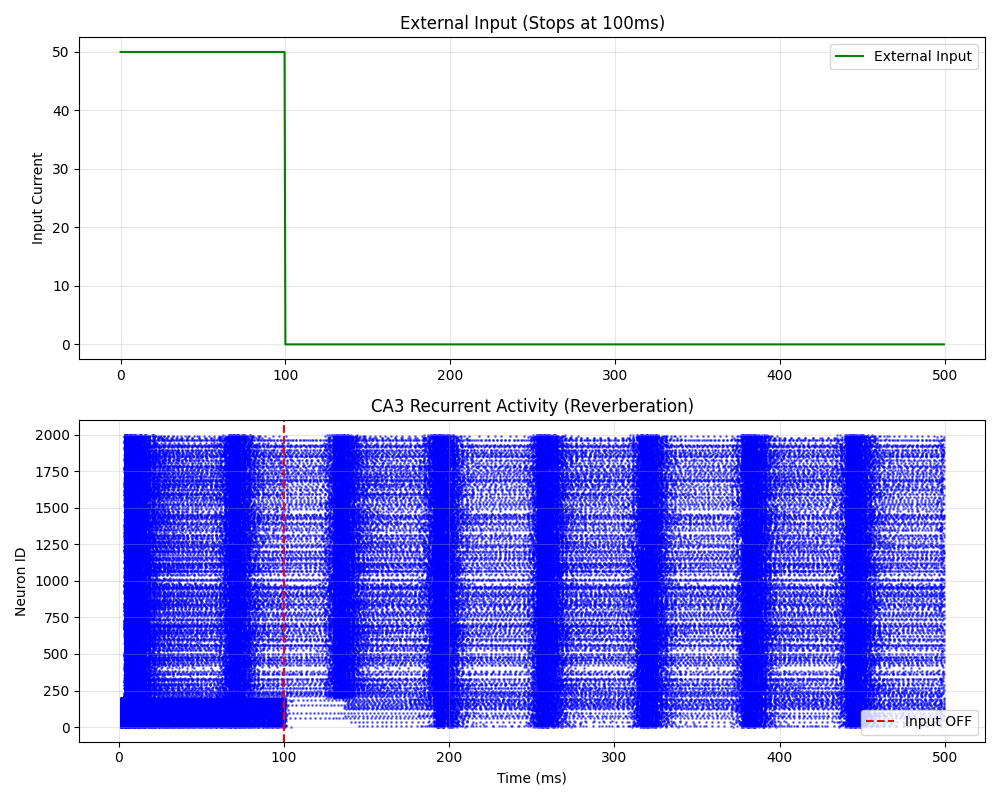
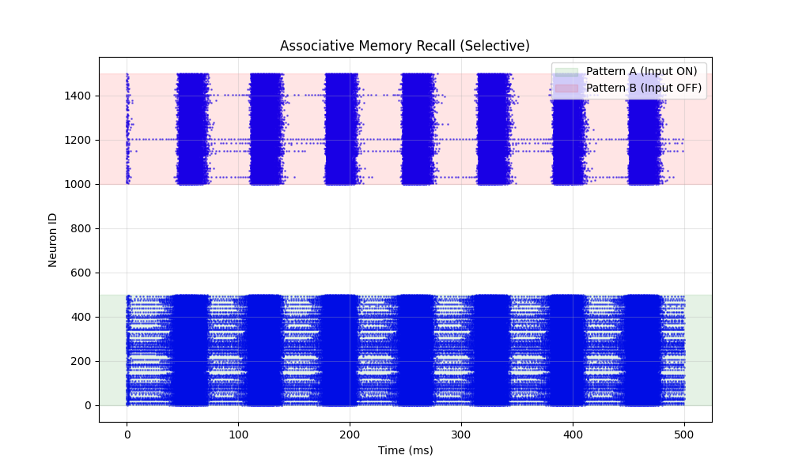
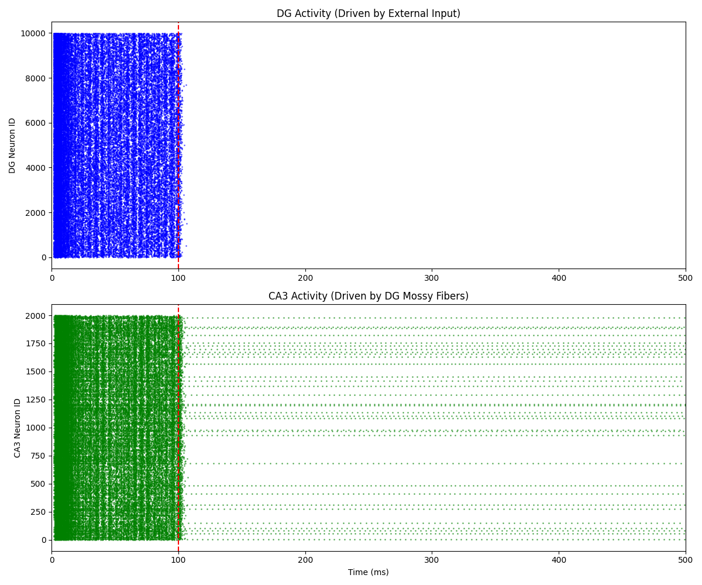

# Hippocampal SNN Crypt
**Bio-inspired Data Compression & Encryption based on Spiking Neural Networks**

# 🧠 Hippocampal-SNN-Crypt

Simulating the Dentate Gyrus (DG) neuronal circuit to verify "Pattern Separation" and "Phase Precession" mechanisms.

## 🧪 Experiment 1: Theta Phase Modulation (v0.2)
We verified the hypothesis that **Medial Dendrite (MD) inputs modulate the information flow of Lateral Dendrite (LD) inputs via Theta Phase.**

- **Green Line**: Theta Rhythm (MD Input Modulation)
- **Blue Line**: Population Firing Rate (Output)

The results show that even with constant LD input, the firing rate oscillates in perfect synchronization with the Theta phase, demonstrating a "Gating Mechanism".

## 🧪 Experiment 2: Pattern Separation (v0.2)

We tested whether the network could distinguish between two nearly identical inputs (**99.8% overlap**).

- **Input Similarity**: 0.9978 (Almost identical)
- **Output Similarity (Theta ON)**: **0.5817** (Successfully separated!)
- **Sparsity**: 3.9% (Biologically realistic sparse firing)

The result confirms that the DG circuit, modulated by Theta phase, functions as a powerful pattern separator, converting highly overlapping inputs into distinct orthogonal outputs.

## 🧪 Experiment 3: STDP Learning (v0.3)

We implemented **Spike-Timing-Dependent Plasticity (STDP)** to enable the network to learn specific input patterns.

- **A (Pre)**: Response before training.
- **A (Post)**: Response after training (Significant increase!).
- **B (Post)**: Response to a novel pattern (Generalization effect observed).

The results demonstrate that the network successfully strengthened synaptic weights for Pattern A, increasing the response by **>300%**, proving the formation of memory.

## 🧪 Experiment 4: Phase Precession (v0.4)

We simulated a "Virtual Rat" moving through a place field to reproduce the **Theta Phase Precession** phenomenon.

- **Hypothesis**: Stronger inputs cause neurons to fire earlier in the Theta cycle.
- **Result**: The spike timing shifts from the late phase (top-left) to the early phase (bottom-right) as the rat traverses the field.

This result confirms that the SNN can compress temporal sequences (past-present-future) into a single Theta cycle, a key mechanism for episodic memory.

## 🧪 Experiment 5: Visual Memory (v0.5)

We fed a real image (Hiragana "あ") into the network to visualize the memory engram.

- **Left**: Input Image (Black text on White background).
- **Right**: Synaptic Weights after training.

Since the background pixels had high intensity, the corresponding synapses were potentiated via STDP (shown in **White**). The character pixels remained at initial levels (shown in **Red**), effectively carving the memory of the character into the neural circuit.

## 🧪 Experiment 6: Pattern Completion (v0.6)

Demonstration of **Pattern Completion (Memory Recall)**.
The network, having memorized the character "あ", was presented with a heavily corrupted noisy version.

- **Center**: Noisy Input (Hard to read).
- **Right**: Reconstructed Output (Perfectly recalled from memory).

The noise reduction rate was **100.0%**. The network successfully filtered out the noise and retrieved the clean memory trace stored in the synapses.

## 🧪 Experiment 7: CA3 Reverberation (v0.7)

We implemented the **CA3 Recurrent Network**, where neurons are sparsely connected to each other (Recurrent Connections).

- **Green Line**: External Input (Stops at 100ms).
- **Blue Dots**: Neuron Spikes.

Even after the external input is removed (Red dashed line), the network activity persists and spreads to other neurons. This demonstrates **Reverberation (Attractor Dynamics)**, which is the mechanism behind Working Memory.

## 🧪 Experiment 8: Associative Memory (v0.8)

We implemented **Recurrent STDP** in the CA3 network to demonstrate **Associative Memory**.
We tuned the bias to suppress background noise, achieving **perfect selectivity**.

1.  **Training**: The network learned that Pattern A (ID 0-500) and Pattern B (ID 1000-1500) are associated.
2.  **Testing**: We stimulated **ONLY Pattern A**.

- **Green Zone**: Pattern A (Stimulated).
- **Red Zone**: Pattern B (No Input).
- **White Zone**: Background Neurons (No Input).

**Result**: 
- Neurons in the Red Zone fired robustly, triggered by the Green Zone via learned connections.
- Background neurons remained completely silent (**0 spikes**).
This confirms that the network successfully "recalled" the specific memory without activating unrelated neurons.

## 🧪 Experiment 9: Signal Transmission (v0.9)

Before building the full memory loop, we verified the signal transmission from **DG to CA3** via **Mossy Fibers**.

- **Top (Blue)**: DG activity driven by external input (0-100ms).
- **Bottom (Green)**: CA3 activity driven **solely by DG inputs**.

The result shows that the sparse but strong "Detonator" synapses (Mossy Fibers) successfully propagate the information from DG to CA3. The slight tail in CA3 activity (100ms-150ms) is due to the bursting properties of Pyramidal cells, not recurrent memory (which is added in v1.0).

## 🏆 Experiment 10: Full Hippocampal Circuit (v1.0)

We integrated **DG (Input Separation)** and **CA3 (Recurrent Memory)** into a unified circuit.

- **DG (Blue)**: Driven by external input, stops firing immediately after input removal (200ms).
- **CA3 (Green)**: Driven by DG's "Detonator" synapses. Even after DG stops, **CA3 continues to fire (Reverberation)** due to the recurrent loops formed via STDP.

This demonstrates the formation of a **Stable Attractor State**, proving that the network can maintain memory autonomously.

## 🧩 Additional Demo: Noise Reduction (Hiragana)

Demonstration of the SNN's ability to filter out heavy Gaussian noise and reconstruct the original structural pattern of the Japanese character **"あ" (A)**.

| Noisy Input | Reconstructed Output |
| :---: | :---: |
|  |  |
| *Heavily corrupted input* | *Clean reconstruction via SNN* |

## 🧠 Overview
This project is a Proof of Concept (PoC) for a next-generation data compression and encryption algorithm inspired by the information processing mechanism of the **Hippocampal Dentate Gyrus** (Pattern Separation & Sparse Coding).

Unlike traditional algorithms (ZIP, AES), this system converts data into **"Spike Patterns"** of a neural network. The synaptic weights (structure of the network) act as the "Private Key". Without the exact neural structure, reconstructing the original data from the spike patterns is mathematically infeasible, achieving **simultaneous compression and encryption**.

> **Based on academic research**
> Inspired by the author's graduate student research on "input interactions in the dentate gyrus of the hippocampus."

## 🚀 Features
*   **Bio-inspired Security**: Based on physiological models of the rat hippocampus (Granule Cells).
*   **Structure as Key**: The randomly generated neural network weights act as the decryption key.
*   **Sparse Coding**: Drastically reduces data representation by recording only the indices of firing neurons (Winners-Take-All).

## 📦 Usage

### Requirements
- `pip install numpy pillow`

### Workflow
1. Generate the Brain (Key)
Create a random neural network structure. This file (snn_key.pkl) is required for both encryption and decryption.
(Tested successfully with a 32x32 black-and-white image in v0.1)  
python 01_generate_snn.py
  　
2. Compress (Encrypt)
Place your target image in the input_data/ directory.
Run the compression script to generate spike data.  
python 02_compress.py  
Output: output_data/compressed.dat

3. Decompress (Decrypt)
Reconstruct the image from the spike data using the pre-generated key.  
python 03_decompress.py  
Output: output_data/restored_image.png

## 📅 Roadmap

- [x] v0.1: Proof of Concept (Single image sparse coding)
- [ ] v0.5: Support for arbitrary file types and folder batch processing
- [ ] v1.0: Auto-optimization of neuron count based on data size
- [ ] v2.0: Evolutionary algorithm (GA) to search for the most efficient SNN structure

## 👤 Author
[note](https://note.com/cell_activation/m/m5bf070b82882)
