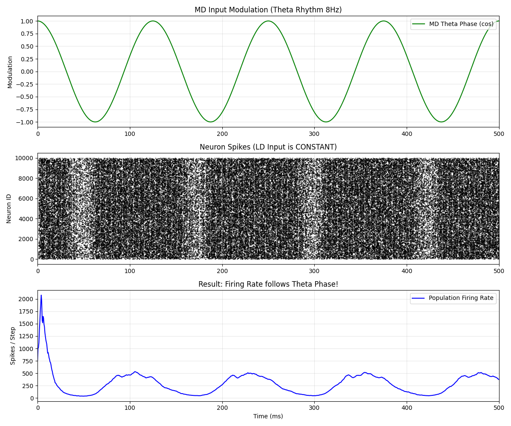
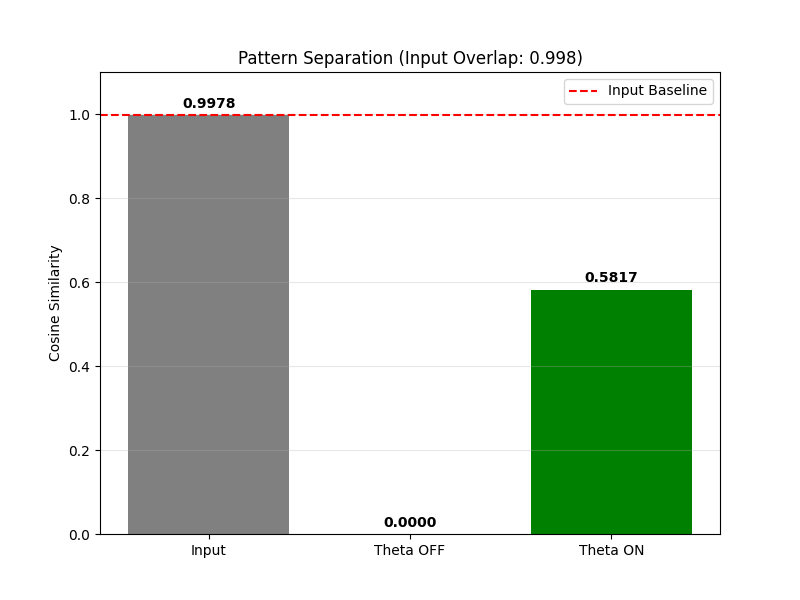
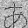

# Hippocampal SNN Crypt
**Bio-inspired Data Compression & Encryption based on Spiking Neural Networks**

# 🧠 Hippocampal-SNN-Crypt

Simulating the Dentate Gyrus (DG) neuronal circuit to verify "Pattern Separation" and "Phase Precession" mechanisms.

## 🧪 Experiment 1: Theta Phase Modulation (v0.2)
We verified the hypothesis that **Medial Dendrite (MD) inputs modulate the information flow of Lateral Dendrite (LD) inputs via Theta Phase.**

- **Green Line**: Theta Rhythm (MD Input Modulation)
- **Blue Line**: Population Firing Rate (Output)

The results show that even with constant LD input, the firing rate oscillates in perfect synchronization with the Theta phase, demonstrating a "Gating Mechanism".

## 🧪 Experiment 2: Pattern Separation (v0.2)

We tested whether the network could distinguish between two nearly identical inputs (**99.8% overlap**).

- **Input Similarity**: 0.9978 (Almost identical)
- **Output Similarity (Theta ON)**: **0.5817** (Successfully separated!)
- **Sparsity**: 3.9% (Biologically realistic sparse firing)

The result confirms that the DG circuit, modulated by Theta phase, functions as a powerful pattern separator, converting highly overlapping inputs into distinct orthogonal outputs.

## 🧩 Additional Demo: Noise Reduction (Hiragana)

Demonstration of the SNN's ability to filter out heavy Gaussian noise and reconstruct the original structural pattern of the Japanese character **"あ" (A)**.

| Noisy Input | Reconstructed Output |
| :---: | :---: |
|  |  |
| *Heavily corrupted input* | *Clean reconstruction via SNN* |

## 🧠 Overview
This project is a Proof of Concept (PoC) for a next-generation data compression and encryption algorithm inspired by the information processing mechanism of the **Hippocampal Dentate Gyrus** (Pattern Separation & Sparse Coding).

Unlike traditional algorithms (ZIP, AES), this system converts data into **"Spike Patterns"** of a neural network. The synaptic weights (structure of the network) act as the "Private Key". Without the exact neural structure, reconstructing the original data from the spike patterns is mathematically infeasible, achieving **simultaneous compression and encryption**.

> **Based on academic research**
> Inspired by the author's graduate student research on "input interactions in the dentate gyrus of the hippocampus."

## 🚀 Features
*   **Bio-inspired Security**: Based on physiological models of the rat hippocampus (Granule Cells).
*   **Structure as Key**: The randomly generated neural network weights act as the decryption key.
*   **Sparse Coding**: Drastically reduces data representation by recording only the indices of firing neurons (Winners-Take-All).

## 📦 Usage

### Requirements
- `pip install numpy pillow`

### Workflow
1. Generate the Brain (Key)
Create a random neural network structure. This file (snn_key.pkl) is required for both encryption and decryption.
(Tested successfully with a 32x32 black-and-white image in v0.1)  
python 01_generate_snn.py
  　
2. Compress (Encrypt)
Place your target image in the input_data/ directory.
Run the compression script to generate spike data.  
python 02_compress.py  
Output: output_data/compressed.dat

3. Decompress (Decrypt)
Reconstruct the image from the spike data using the pre-generated key.  
python 03_decompress.py  
Output: output_data/restored_image.png

## 📅 Roadmap

- [x] v0.1: Proof of Concept (Single image sparse coding)
- [ ] v0.5: Support for arbitrary file types and folder batch processing
- [ ] v1.0: Auto-optimization of neuron count based on data size
- [ ] v2.0: Evolutionary algorithm (GA) to search for the most efficient SNN structure

## 👤 Author
[note](https://note.com/cell_activation/m/m5bf070b82882)
